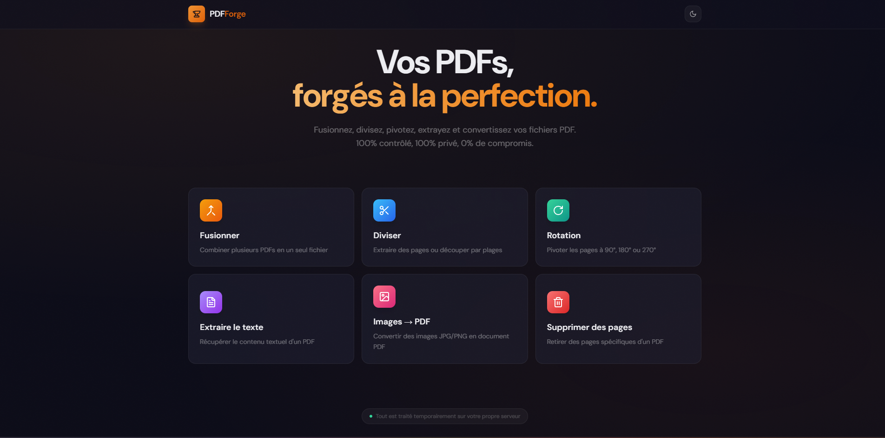
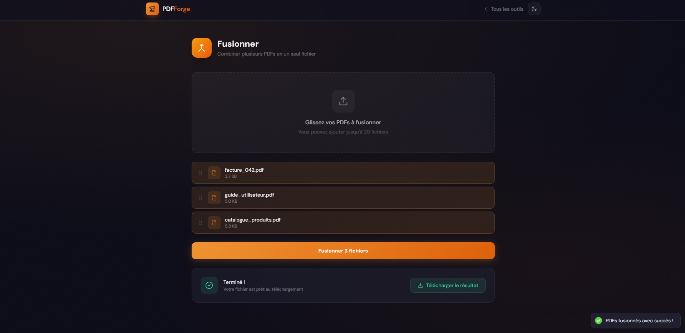

# 📄 PDFForge

> A modern, privacy-first PDF toolkit to merge, split, rotate, extract & convert files.  
> No uploads to third-party servers. Everything runs on **your** server, giving you full control over your data.

---

## ✨ Features

Tired of public or cloud-based document solutions, I built a customizable local-first project that can be deployed and adapted for any business.

The demo includes the following features, but many more can be added to meet your specific needs:

| Feature | Description |
|---------|-------------|
| **Merge** | Combine multiple PDFs into one with drag & drop reordering |
| **Split** | Extract specific pages or split by range |
| **Rotate** | Rotate pages by 90°, 180°, or 270° |
| **Extract Text** | Extract metadata and text content from any PDF |
| **Images → PDF** | Convert JPG/PNG/WebP images into a PDF document |
| **Remove Pages** | Delete specific pages with a visual page selector |
| **Theming** | Light, Dark, and System themes with smooth transitions |

Deployment and monitoring are included as part of the service.  
The project can be setup on your local machine, LAN, or hosted infrastructure with a secure and easy-to-configure architecture.

---

## 🔒 Privacy

All processing happens on your own server. Files are never uploaded to external services. Temporary files are automatically cleaned based on your configuration. All data is compressed and transferred using high secured protocols.

---

## 💼 Pricing & Contact

This project is a **paid solution**, tailored to business needs.

For pricing, custom features, or deployment details, please contact:

📧 **tolgasahin61000@gmail.com**